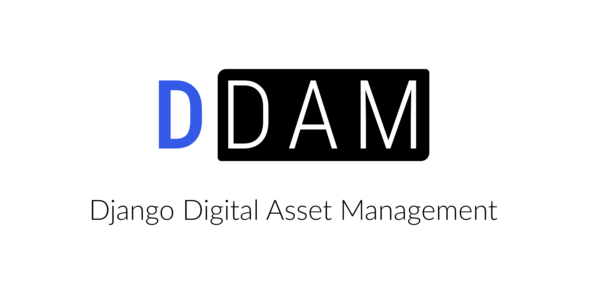

# DDAM



🖼 ➕ 🗃 ➕ ⚖️ **Django Digital Asset Management** (spoken as *da-miŋ*)

*Ever thought about using a spreadsheet to manage the licenses and copyrights of photos? Ditch the spreadsheet and use DDAM:*

A small, focused, feature arm, minimal, web based, work in progress system to link digital assets to licenses and track their use.

## 🏆 Features

* Store digital assets. Currently only images (jpg, png, svg, webp, avif etc.) are supported.
* Link licenses to assets. 
* Track usage of assets.
* Web based, multi user
* (Optional) Login via LDAP/AD

## 💪 Requirements

* Python 3
* npm

## 🦘 Run

```bash
# Set your environment via .env
cp .env.dist .env  

# Build static files (css/js)
npm install && npm run build

# Prepare Django
pip install --requirement requirements.txt
./manage.py migrate
./manage.py createsuperuser
./manage.py runserver
```

## 🛝 Demo instance

[https://ddam.thms.de/](https://ddam.thms.de/)

Please [poke me](mailto:mail@thms.de) if you would like an account.


## 👏 Thanks

I can't thank the people enough who make my work possible through their awesome and free ("free" as in "free speech") software and free projects. 

My special thanks go to the projects:

* [Django](https://www.djangoproject.com/)
* [Bootstrap](https://getbootstrap.com/)
* ...and countless other (see `requirements.txt` and `packages.json`)
 
## 🐞 Tests

Pull requests welcome.

## ☄ Need help?

For support, feature requests, hosting/on-premise or whatever, please fill an issue or contact [Thomas Breitner via his website](https://thms.de/).
